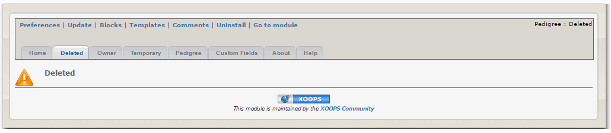
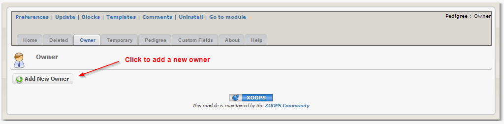
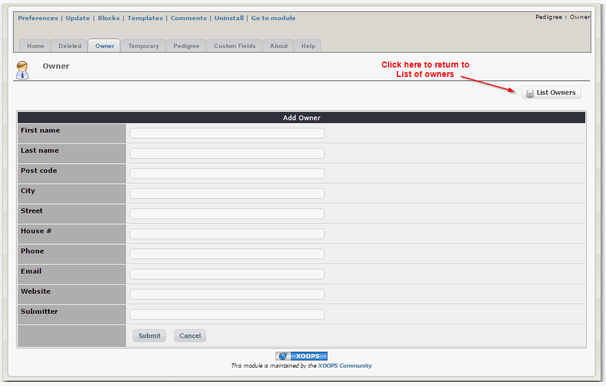
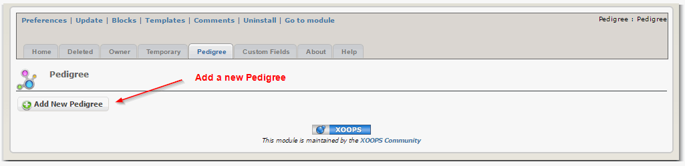
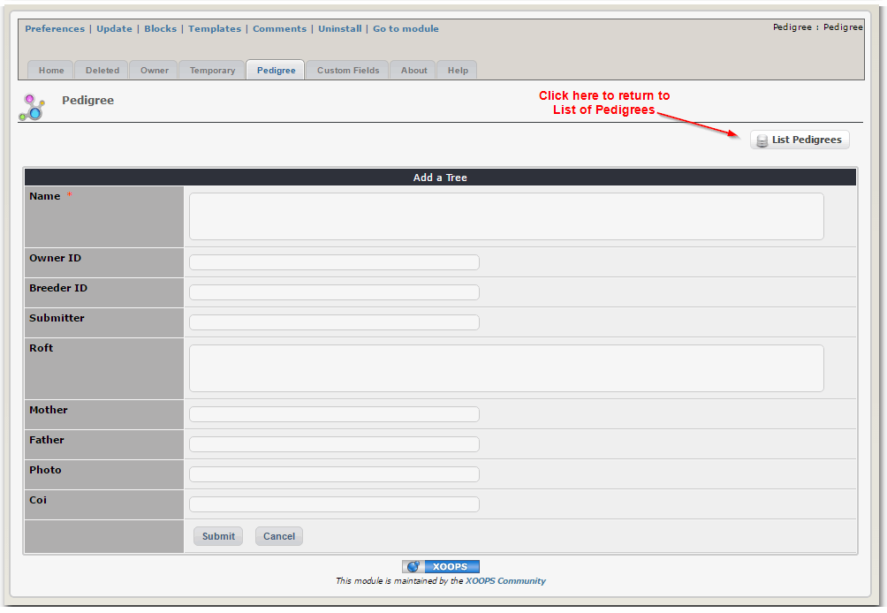
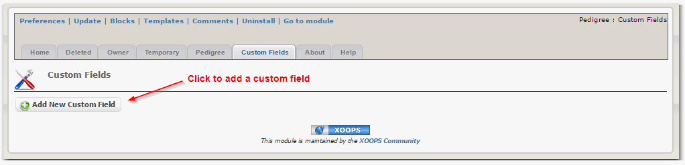
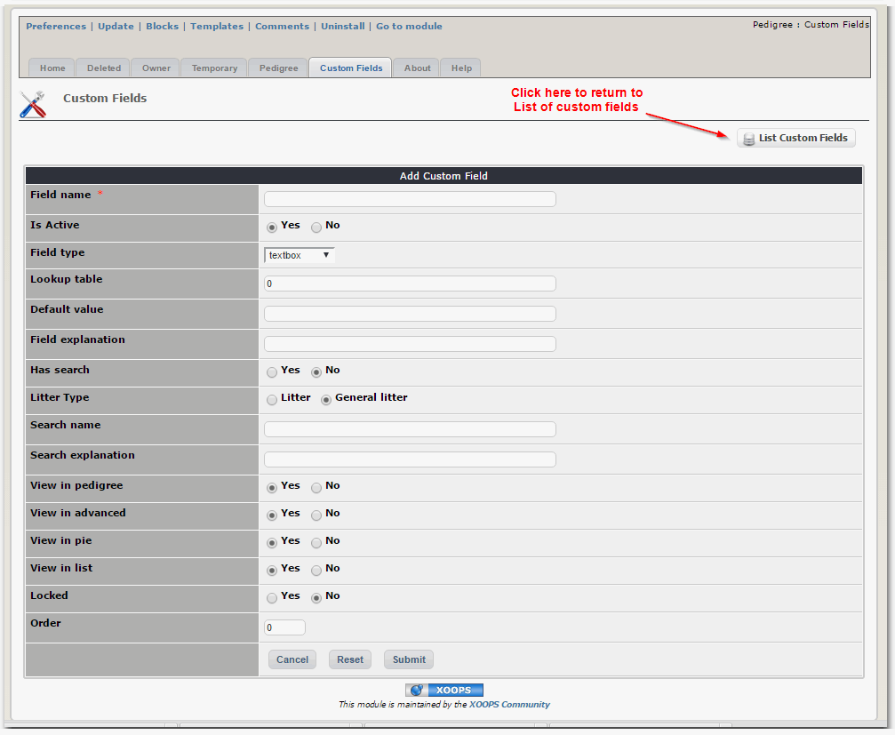
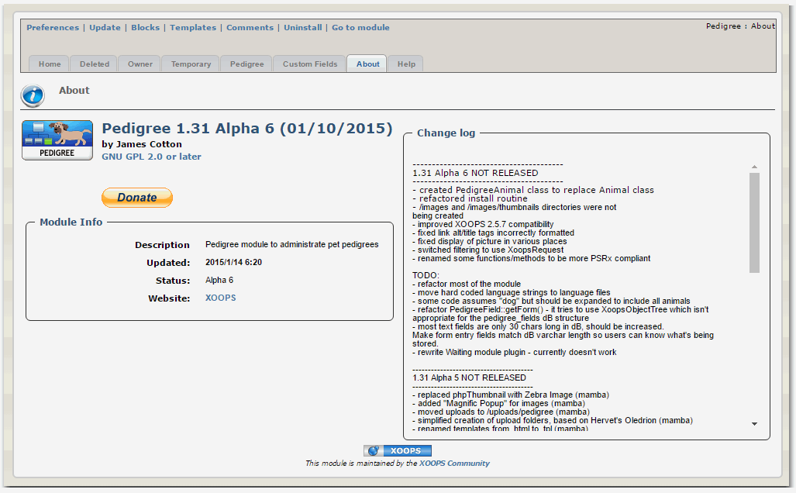

# 4.0 Operating Instructions

In this tab, you can see records marked as deleted

It the "Owner" tab, you can add new owners:

After the Owner form opens, you can the required information

In the "Pedigree" tab, you can view existing Pedigrees, and add new ones:

Submit the required information:

You can also create "Custom Fields":

Decide what "Custom Field" you would like to have:

In the "About" tab, you can learn more about the module, and read the latest "changelog":

