# 4.0 b Front End Operations 

Currently in the front, we have following menu items:

* General setting 
* Language options 
* Create user field 
* List user field 
* Define colors 
* Delete pedigree's 
* Database tools 
* Credits 
* Logout 

Some of them will go soon away, as they are being moved to the [Preferences](3prerences.md)

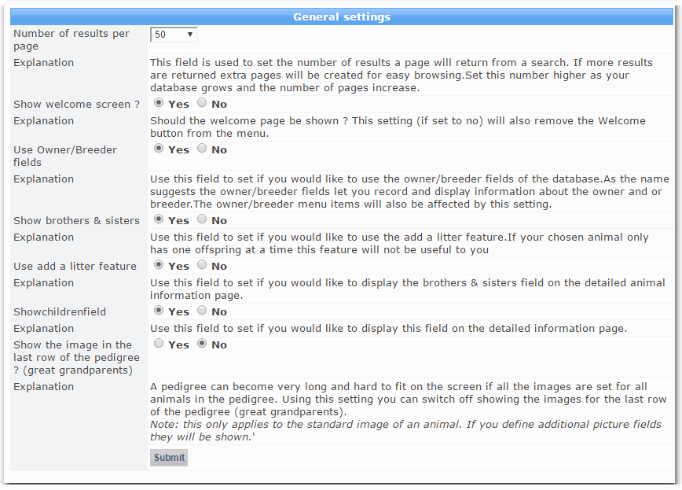

### Language options
 
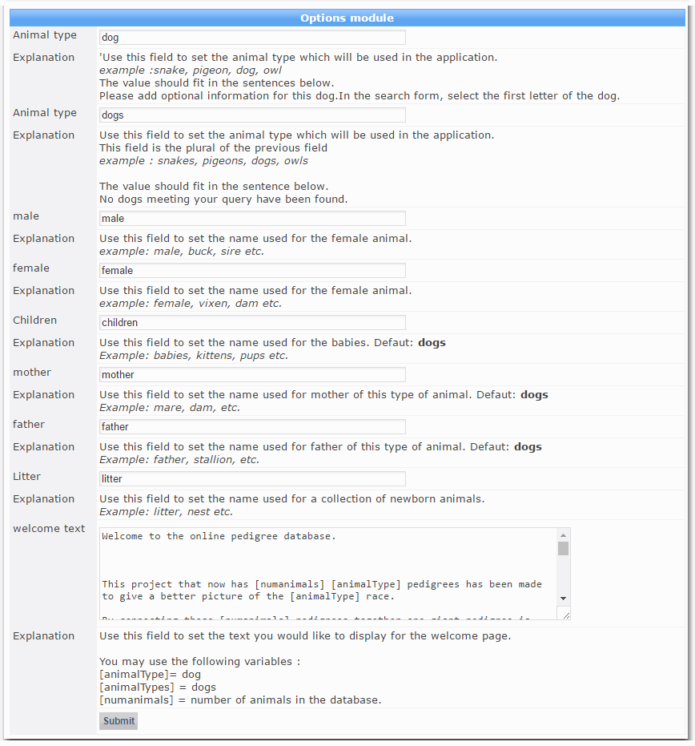

### Create user field 

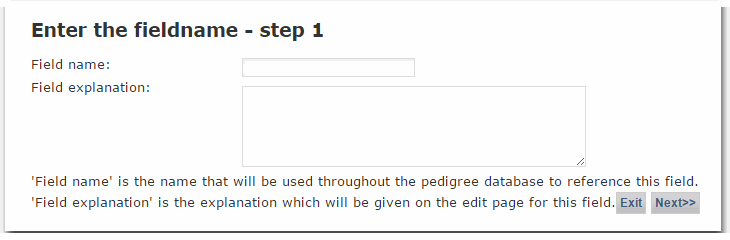

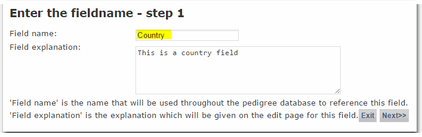

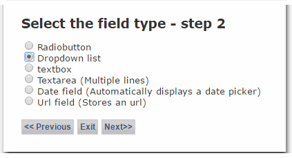

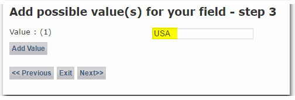

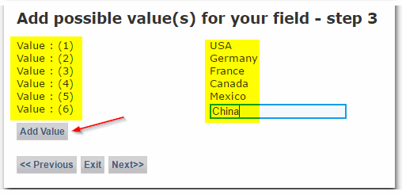

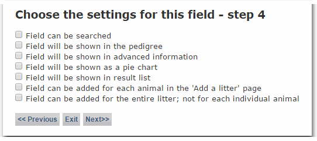

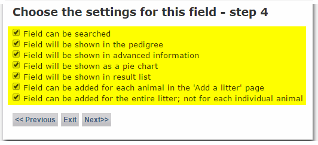

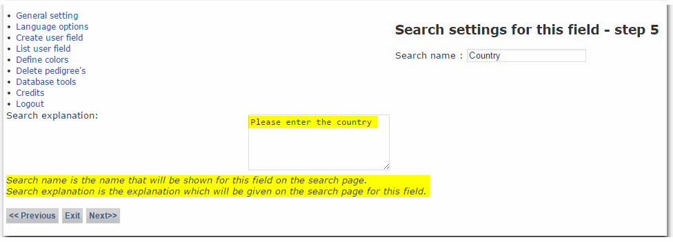

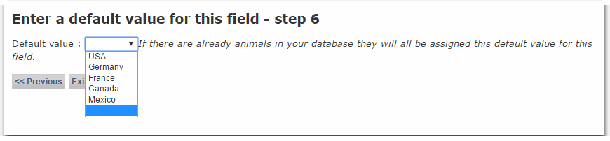

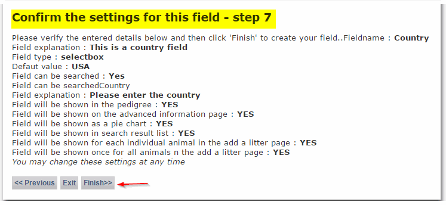

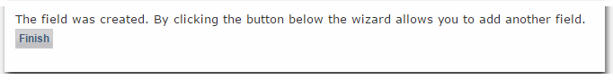

### List user field 

* 
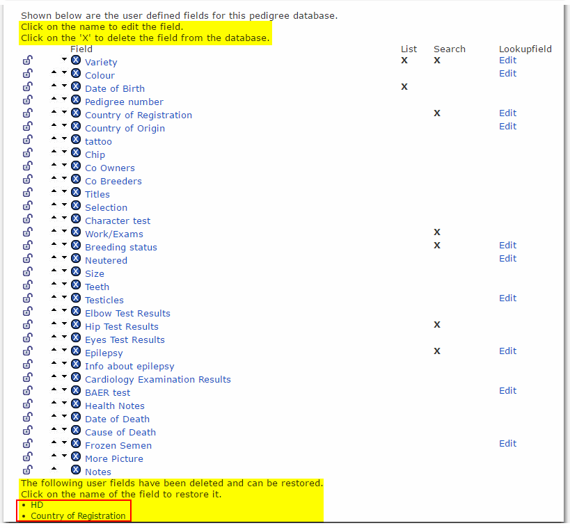

### Define colors 

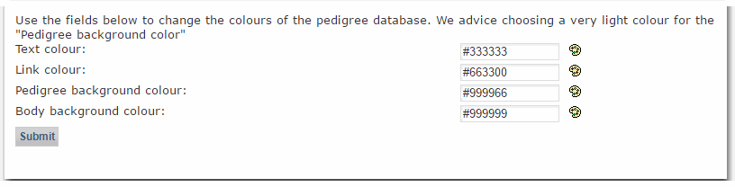

### Delete pedigree's 

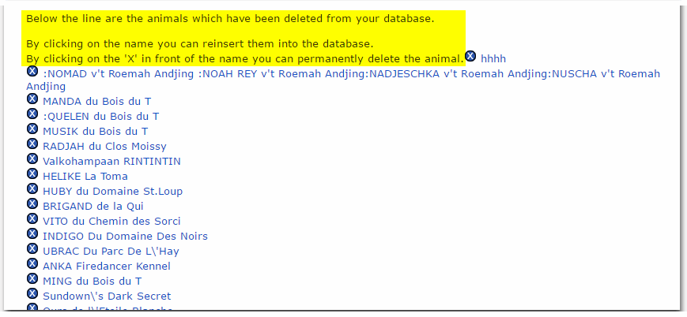

### Database tools 

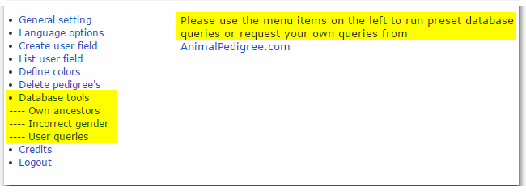

### Credits 

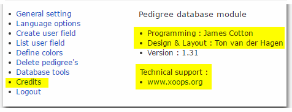
