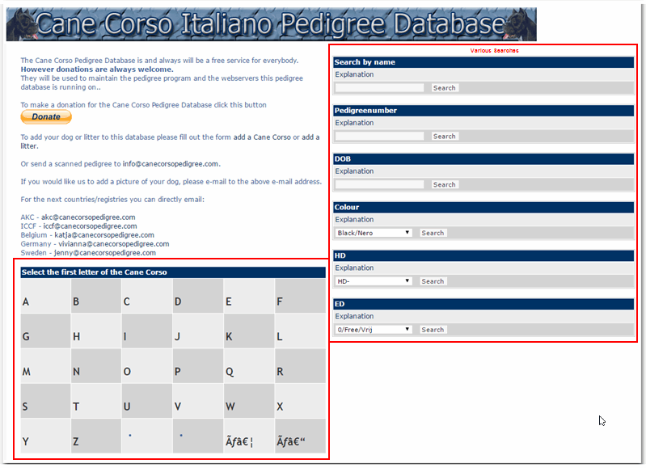
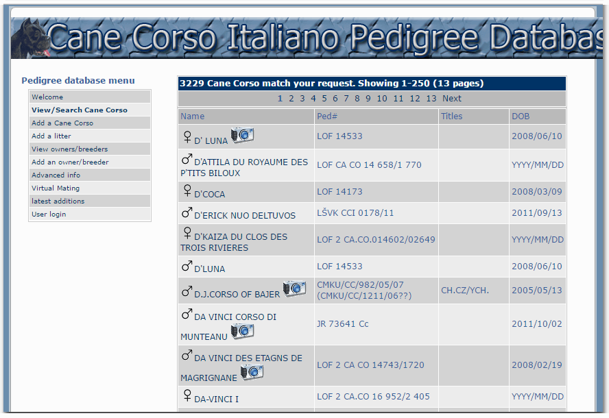
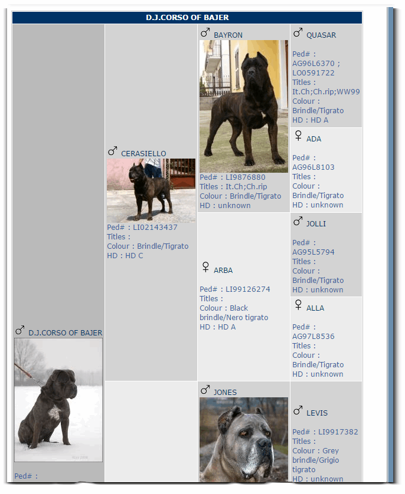

# 5.0 The User Side

This is an example taken from the Cane Corso Italiano Pedigree Database:

You can do different searchs, or you can click on individual letter:

When you click on the letter, you will get a list of all dogs with names starting with it:

The "camera" image indicates that the dog has a picture. When you click on it, you'll see the pedigree of the dog, with the ancestors:

